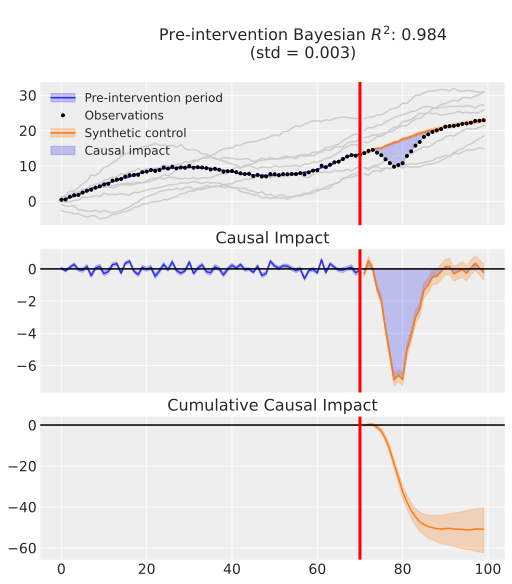
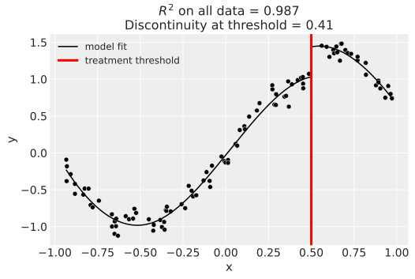
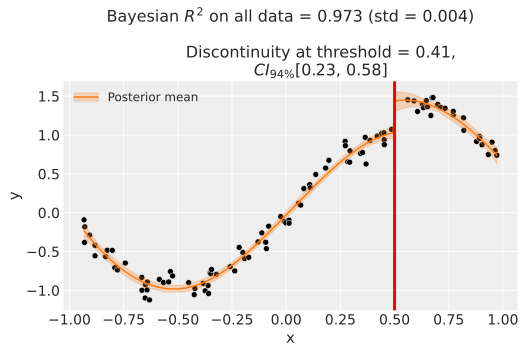

# CausalPy


[](https://github.com/psf/black)
[](https://badge.fury.io/py/CausalPy)


A Python package focussing on causal inference in quasi-experimental settings. The package allows for sophisticated Bayesian model fitting methods to be used in addition to traditional OLS.

_**STATUS:** Feel free to explore and experiment with the repository, and we very much welcome feedback (via [Issues](https://github.com/pymc-labs/CausalPy/issues)). But be aware that this code is very alpha! Expect the codebase and API to change for a while, so it is not appropriate to rely on this package for in-production or research pipelines._

## Comparison to related packages

Rather than focussing on one particular quasi-experimental setting, this package aims to have broad applicability.

Another distinctive feature of this package is the ability to use different models. Currently, users can fit with `scikit-learn` models or Bayesian models with `PyMC`.

|                           | [CausalImpact](https://google.github.io/CausalImpact/) from Google | [GeoLift](https://github.com/facebookincubator/GeoLift/) from Meta | CausalPy from [PyMC Labs](https://www.pymc-labs.io) |
|---------------------------|--------------------------------|---------|----------------------------------------|
| Synthetic control         | ✅                              | ✅       | ✅                                      |
| Regression discontinuity  | ❌                              | ❌       | ✅                                      |
| Difference in differences | ❌                              | ❌       | ✅                                      |
| Language                  | R (but see [tfcausalimpact](https://github.com/WillianFuks/tfcausalimpact))  | R       | Python                                 |
| Models                    | Bayesian structural timeseries | Augmented synthetic control      | Flexible: Traditional OLS and Bayesian models |

## Installation

To get the latest release:
```bash
pip install CausalPy
```

Alternatively, if you want the very latest version of the package you can install from GitHub:

```bash
pip install git+https://github.com/pymc-labs/CausalPy.git
```

## Quickstart

```python
import causalpy as cp


# Import and process data
df = (
    cp.load_data("drinking")
    .rename(columns={"agecell": "age"})
    .assign(treated=lambda df_: df_.age > 21)
    )

# Run the analysis
result = cp.pymc_experiments.RegressionDiscontinuity(
    df,
    formula="all ~ 1 + age + treated",
    running_variable_name="age",
    prediction_model=cp.pymc_models.LinearRegression(),
    treatment_threshold=21,
    )

# Visualize outputs
fig, ax = result.plot();

# Get a results summary
result.summary()
```

## Roadmap

Plans for the repository can be seen in the [Issues](https://github.com/pymc-labs/CausalPy/issues).

## Overview of package capabilities

### Synthetic control
This is appropriate when you have multiple units, one of which is treated. You build a synthetic control as a weighted combination of the untreated units.

| Time | Outcome   | Control 1 | Control 2 | Control 3 |
|------|-----------|-----------|-----------|-----------|
| 0    | $y_0$ | $x_{1,0}$ | $x_{2,0}$ | $x_{3,0}$ |
| 1    | $y_1$ | $x_{1,1}$ | $x_{2,1}$ | $x_{3,1}$ |
|$\ldots$ | $\ldots$  | $\ldots$  | $\ldots$  | $\ldots$  |
| T    | $y_T$ | $x_{1,T}$ | $x_{2,T}$ | $x_{3,T}$ |


| Frequentist | Bayesian |
|--|--|
|  |  |

> The data (treated and untreated units), pre-treatment model fit, and counterfactual (i.e. the synthetic control) are plotted (top). The causal impact is shown as a blue shaded region. The Bayesian analysis shows shaded Bayesian credible regions of the model fit and counterfactual. Also shown is the causal impact (middle) and cumulative causal impact (bottom).

### Difference in Differences

This is appropriate when you have a single pre and post intervention measurement and have a treament and a control group.

Data is expected to be in the following form. Shown are just two units - one in the treated group (`group=1`) and one in the untreated group (`group=0`), but there can of course be multiple units per group. This is panel data (also known as repeated measures) where each unit is measured at 2 time points.

| Unit | Time | Group | Outcome         |
|------|---|-------|-----------|
| 0    | 0 | 0     | $y_{0,0}$ |
| 0    | 1 | 0     | $y_{0,0}$ |
| 1    | 0 | 1     | $y_{1,0}$ |
| 1    | 1 | 1     | $y_{1,1}$ |

| Frequentist | Bayesian |
|--|--|
|  |  |

The data, model fit, and counterfactual are plotted. Frequentist model fits result in points estimates, but the Bayesian analysis results in posterior distributions, represented by the violin plots. The causal impact is the difference between the counterfactual prediction (treated group, post treatment) and the observed values for the treated group, post treatment.

### Regression discontinuity designs

Regression discontinuity designs are used when treatment is applied to units according to a cutoff on the running variable (e.g. $x$) which is typically _not_ time. By looking for the presence of a discontinuity at the precise point of the treatment cutoff then we can make causal claims about the potential impact of the treatment.

| Running variable | Outcome | Treated  |
|-----------|-----------|----------|
| $x_0$     | $y_0$     | False    |
| $x_1$     | $y_0$     | False    |
| $\ldots$  | $\ldots$  | $\ldots$ |
| $x_{N-1}$ | $y_{N-1}$ | True     |
| $x_N$     | $y_N$     | True     |


| Frequentist | Bayesian |
|--|--|
|  |  |

> The data, model fit, and counterfactual are plotted (top). Frequentist analysis shows the causal impact with the blue shaded region, but this is not shown in the Bayesian analysis to avoid a cluttered chart. Instead, the Bayesian analysis shows shaded Bayesian credible regions of the model fits. The Frequentist analysis visualises the point estimate of the causal impact, but the Bayesian analysis also plots the posterior distribution of the regression discontinuity effect (bottom).

## Learning resources

Here are some general resources about causal inference:

* The official [PyMC examples gallery](https://www.pymc.io/projects/examples/en/latest/gallery.html) has a set of examples specifically relating to causal inference.
* Angrist, J. D., & Pischke, J. S. (2009). Mostly harmless econometrics: An empiricist's companion. Princeton university press.
* Angrist, J. D., & Pischke, J. S. (2014). Mastering'metrics: The path from cause to effect. Princeton university press.
* Cunningham, S. (2021). [Causal inference: The Mixtape](https://mixtape.scunning.com). Yale University Press.
* Huntington-Klein, N. (2021). [The effect: An introduction to research design and causality](https://theeffectbook.net). Chapman and Hall/CRC.
* Reichardt, C. S. (2019). Quasi-experimentation: A guide to design and analysis. Guilford Publications.

## License

[Apache License 2.0](LICENSE)

---

## Support


This repository is supported by [PyMC Labs](https://www.pymc-labs.io).

If you are interested in seeing what PyMC Labs can do for you, then please email [ben.vincent@pymc-labs.io](mailto:ben.vincent@pymc-labs.io). We work with companies at a variety of scales and with varying levels of existing modeling capacity. We also run corporate workshop training events and can provide sessions ranging from introduction to Bayes to more advanced topics.
